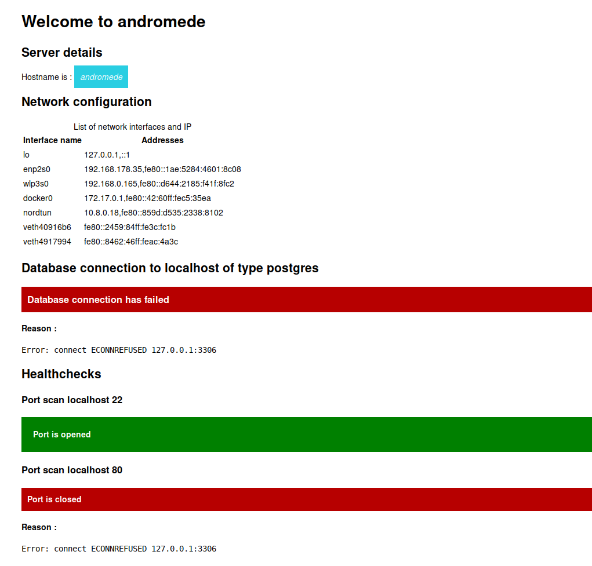

# Docker SmokeTest image

Docker image to display a basic web app with some additional health checks (DB, pings)

[](https://github.com/sleroy/smoketest-docker-webserver/actions/workflows/docker-image.yml)

[](https://github.com/sleroy/smoketest-docker-webserver/actions/workflows/node.js.yml)

[](https://github.com/sleroy/smoketest-docker-webserver/actions/workflows/github-code-scanning/codeql)

Docker hub page : [Dockerhub page](https://hub.docker.com/repository/docker/sylvainleroy/smoketest-docker-webserver)




## Overview

Docker SmokeTest is a project aimed at providing a Docker image designed for cloud-based container architectures such as AWS ECS, AWS EKS, or GCP GKE. The image includes a basic web page exposed on port 80, displaying essential server information, including hostname and IP addresses. Additionally, the image facilitates health checks, including database connection tests for MySQL/MariaDB/PGQL, MongoDB, and DynamoDB.

## Features

- **Basic Web Page**: The Docker image exposes a simple web page on port 80, showcasing server details.

- **Hostname and IP Display**: The web page displays the hostname and IP addresses of the servers, aiding in quick identification.

- **Health checks**: The image includes healthchecks to ensure the availability and connectivity of various databases:

  - MySQL/MariaDB/PGQL
  - MongoDB
  - DynamoDB

- **Configuration Options**: Healthcheck configurations can be customized either through a JSON file or via environment variables, offering flexibility in adapting to different environments.

## Usage

### Docker Image Pull

```bash
docker pull docker-smoketest:latest
```

### Run with Environment Variables

```bash

docker run -p 80:80 \
           -e DB_TYPE=mysql \
           -e DB_HOST=my-database-host \
           -e DB_PORT=3306 \
           -e DB_USER=myuser \
           -e DB_PASSWORD=mypassword \
           docker-smoketest:latest
```

### Run with JSON Configuration

```bash

docker run -p 80:80 -v /path/to/config.json:/app/config.json docker-smoketest:latest

```

### Environment

- **DB_TYPE**: Database type (mysql, mongodb, dynamodb, etc.).
- **DB_HOST**: Database host address.
- **DB_PORT**: Database port.
- **DB_USER**: Database username.
- **DB_PASSWORD**: Database password.\*\*: Database password.
- **DB_TIMEOUT**: Database connection timeout

## Database connection configuration

### JSON Format

```json
{
  "database": {
    "type": "mysql",
    "host": "my-database-host",
    "port": 3306,
    "user": "myuser",
    "password": "mypassword",
    "timeout": 5000,
    "debug": false
  },
  "healthchecks": [{ "ip": "127.0.0.1", "port": 80 }]
}
```

## License

This project is licensed under the MIT License.

Feel free to contribute, report issues, or provide suggestions. Happy containerizing!

## Roadmap

- [ ] Support of SecretManager
- [ ] Support of SSM ParameterStore to load the configuration
- [ ] Support of MongoDB
- [ ] Support of DynamoDB
- [ ] Support of S3 health checks
- [ ] Asynchronous checks
